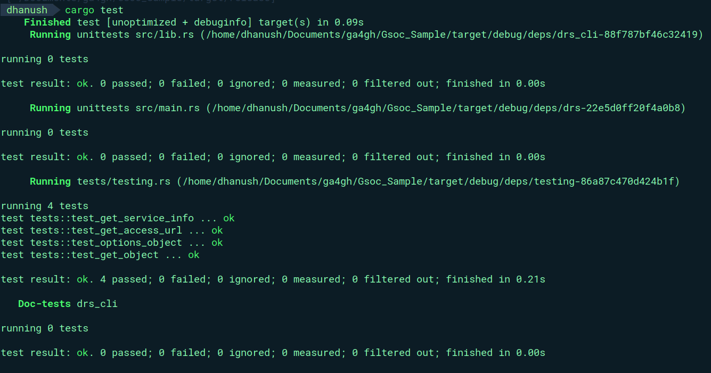

# Sample CLI

This repository contains a CLI for interacting with Data Repository Service(DRS) of Global Alliance for Genomics and Health (GA4GH).

# DRS Service

The service running is the DRS Starter kit version 0.3.2 (Latest version available). Information about the service and object IDs are [here](https://starterkit.ga4gh.org/docs/starter-kit-apis/drs/drs_test_dataset).

## Installation
I have provided the binary in the drs_cli directory, So it can be used directly without building.

Setup DRS service
```bash
docker pull ga4gh/ga4gh-starter-kit-drs:0.3.2
docker run -p 4500:4500 -p 4501:4501 ga4gh/ga4gh-starter-kit-drs:0.3.2
```

Clone the Repo:
```bash
git clone https://github.com/Dhanush0369/Gsoc_sample.git
```
Change directory to drs_cli:
```bash
cd Gsoc_sample/drs_cli
```
Run the commands
```bash
./drs <SUBCOMMAND>
```

## Overview
The CLI has 4 Subcommands 

1. ```./drs service``` : It provides information about the service.
2. ```./drs object <obj_id>``` : It provides the information about the Drs object. 
3. ```./drs access <obj_id> <access_id>``` : It provides the URL for fetching the raw data. 
4. ```./drs authinfo <obj_id>``` : It provides the Authorization info about the Drs object


## Documentation for API Endpoints

Command | Method | HTTP request | Description
------------ | ------------- | ------------- | -------------
access | [**get_access_url**](docs/ObjectsApi.md#get_access_url) | **GET** /objects/{object_id}/access/{access_id} | Get a URL for fetching bytes
object | [**get_object**](docs/ObjectsApi.md#get_object) | **GET** /objects/{object_id} | Get info about a DrsObject.
authinfo | [**options_object**](docs/ObjectsApi.md#options_object) | **OPTIONS** /objects/{object_id} | Get Authorization info about a DrsObject.
service | [**get_service_info**](docs/ServiceInfoApi.md#get_service_info) | **GET** /service-info | Retrieve information about this service

To get access to the crate's generated documentation, use:

```
cargo doc --open
```

## Testing
The tests for testing the functionality of the Functions interacting with the DRS service is written in ``tests`` directory.
<br/>
<p align="center"> </p>
<br/>


## Recording
<br/>
Video of CLI functionality(https://github.com/Dhanush0369/Gsoc_sample/blob/main/screenshots/drs_cli.mp4)


